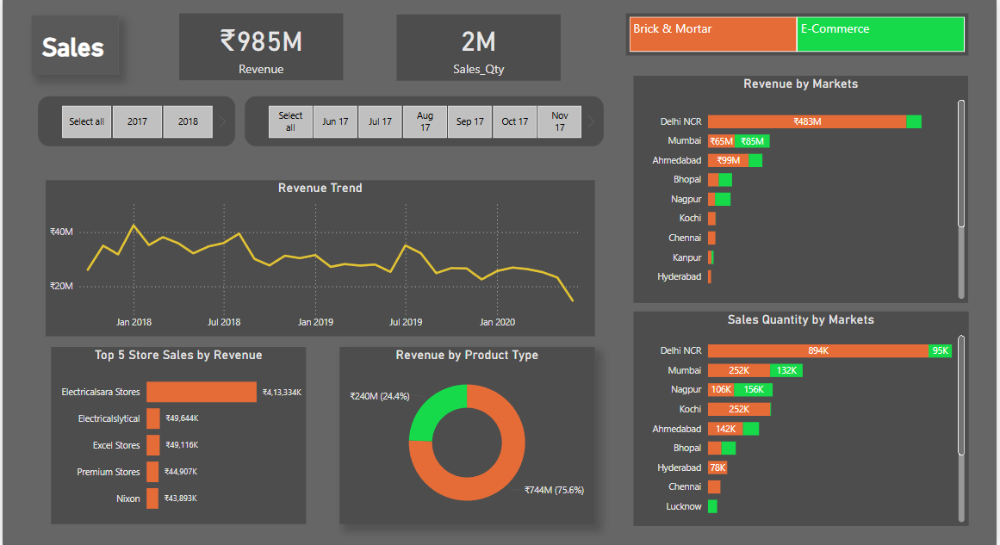

# Sales-Visualization using SQL Server and Power BI
This project presents a comprehensive analysis of a retail sales dataset using SQL for data cleaning, transformation, and querying, followed by interactive visualization in Power BI. The objective is to extract meaningful business insights related to revenue trends, product performance, and market-wise distribution.

This project presents an end-to-end data analytics solution that combines SQL-based data transformation with Power BI dashboarding to analyze sales performance across customers, products, and regions.

---

## 🛠️ Tools & Technologies

- **SQL Server** – Used for data modeling, cleaning, and transformation
- **Power BI** – Interactive visualization and reporting
- **DAX** – Custom KPIs and calculated columns
- **SQL (MY-SQL)** – For querying and preparing datasets

---

## 🧼 Data Preparation & Cleaning (SQL)

- Constructed a relational schema with five core tables: `Transactions`, `Products`, `Markets`, `Customers`, and `Date`
- Cleaned and formatted transaction data (dates, sales, currency)
- Mapped each transaction to product, region, and date dimensions using SQL joins
- Eliminated redundant fields and harmonized column naming conventions

> View SQL scripts: [`Data Cleaning & Exploration.sql`](./SQL_Scripts/Data%20Cleaning%20%26%20Exploration.sql) and [`Data Analysis.sql`](./SQL_Scripts/Data%20Analysis.sql)

---

## 📊 Power BI Dashboard Highlights

- Connected Power BI directly to the SQL Server database
- Created visuals for revenue trends, sales quantity, market segmentation, and seasonal demand
- Built custom DAX measures for:
  - Total sales
  - Year-over-year revenue comparison
  - Revenue contribution by market
  - Product sales classification (High/Low/Average)

---

## 📈 Key Insights

- **Sales declined 57.7% in 2020** compared to 2019 — highlighting the impact of external factors
- **Top performing markets** in terms of revenue and volume: Delhi NCR, Mumbai, Ahmedabad, Bhopal, and Nagpur
- **Most active sales months**: January, November, and March — critical for seasonal planning
- Regional demand and product segmentation uncovered distinct patterns useful for marketing and logistics

- ## 📂 Project Structure

📁 SQL_Scripts
├── Data Cleaning & Exploration.sql
└── Data Analysis.sql

📁 PowerBI
└── Sales_Visualization.pbix

## 📸 Dashboard Preview

### 💼 Overall Sales Summary

